# Jnana — Architecture Deep Dive

> **Jnana** (Sanskrit: ज्ञान, "knowledge") is a Tauri v2 desktop application that functions as a personal knowledge management system — a "second brain." It lets users capture notes enriched with images, videos, PDFs, YouTube embeds, and document attachments, then interconnect them via wikilinks and explore the resulting knowledge graph.

---

## Tech Stack

| Layer | Technology | Role |
|-------|-----------|------|
| **Runtime** | Tauri v2 (WebView2 on Windows) | Native desktop shell, IPC bridge, custom URI protocol |
| **Backend** | Rust | Tauri commands, asset management, file I/O, DB access |
| **Database** | SQLite (rusqlite 0.31, WAL mode) | Persistent storage with schema migrations |
| **Frontend** | React 19 + TypeScript | UI framework |
| **Build** | Vite 7 | Dev server & bundling |
| **Search** | MiniSearch | Client-side full-text search with fuzzy matching |
| **Graph** | react-force-graph-2d | Knowledge graph visualization |
| **Video** | Plyr | Rich video player with custom controls |
| **PDF** | pdfjs-dist | In-app PDF rendering with annotation overlay |
| **Styling** | Vanilla CSS with CSS custom properties | Theming system |

---

## High-Level Architecture

```mermaid
graph TB
    subgraph Desktop["Tauri Desktop Shell"]
        subgraph Frontend["React Frontend (WebView)"]
            App["App.tsx — Router & State Owner"]
            
            subgraph Views["Views"]
                NotesView["Notes View"]
                SearchView["Search View"]
                GraphView["Graph View"]
            end
            
            subgraph Hooks["React Hooks Layer"]
                useNotes["useNotes"]
                useSearch["useSearch"]
                useGraph["useGraph"]
                useAnnotations["useAnnotations"]
                useDocUpload["useDocumentUpload"]
                useAttachments["useNoteAttachments"]
                usePending["usePendingMedia"]
                usePdfAnno["usePdfAnnotations"]
            end
            
            subgraph Core["Core API Layer"]
                CoreNotes["core/notes.ts"]
                CoreSearch["core/search.ts"]
                CoreMedia["core/media.ts"]
                CoreAnno["core/annotations.ts"]
                CoreTags["core/tags.ts"]
            end
            
            subgraph Lib["Library Layer"]
                EventBus["EventBus"]
                PluginReg["PluginRegistry"]
                PluginWorker["PluginWorker"]
            end
        end
        
        subgraph Backend["Rust Backend"]
            subgraph Commands["Tauri Commands"]
                NotesCmds["notes.rs"]
                MediaCmds["media.rs"]
                AnnoCmds["annotations.rs"]
                AssetsCmds["assets.rs"]
            end
            
            subgraph DB["Database Layer"]
                Schema["schema.rs — Migrations"]
                Queries["queries.rs — SQL"]
                DBMod["mod.rs — Init & Paths"]
            end
            
            AssetProto["jnana-asset:// Protocol"]
            SQLite[(SQLite DB)]
            Assets[("assets/ dir")]
        end
    end
    
    App --> Views
    Views --> Hooks
    Hooks --> Core
    Core -->|"invoke()"| Commands
    Core --> EventBus
    Commands --> DB
    DB --> SQLite
    AssetsCmds --> Assets
    MediaCmds --> Assets
    AssetProto --> Assets
    EventBus --> PluginReg
    PluginReg --> PluginWorker
    
    style Desktop fill:#0d0d0f,stroke:#7c6af7,color:#f0eff5
    style Frontend fill:#1a1a2e,stroke:#55535f,color:#f0eff5
    style Backend fill:#16213e,stroke:#55535f,color:#f0eff5
    style SQLite fill:#2a2a35,stroke:#7c6af7,color:#f0eff5
    style Assets fill:#2a2a35,stroke:#7c6af7,color:#f0eff5
```

---

## Database Schema (ER Diagram)

The SQLite database has 5 tables managed by a versioned migration system:

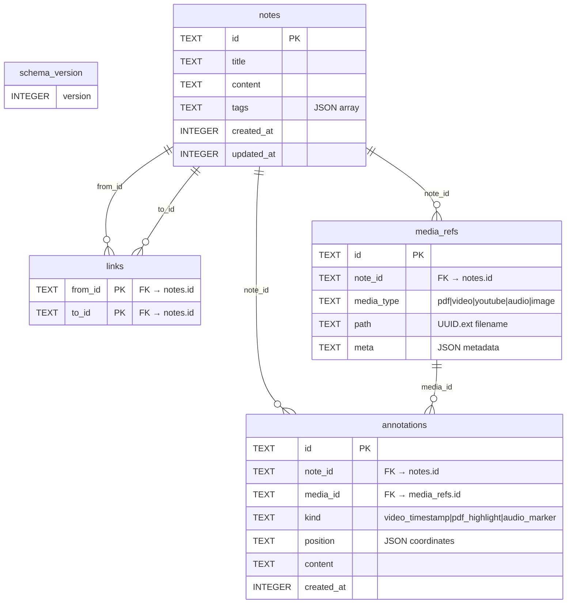

> [!NOTE]
> All foreign keys use `ON DELETE CASCADE` — deleting a note automatically removes its links, media_refs, and annotations. Tags are stored as a JSON array string in the `notes.tags` column and deserialized on read.

---

## Component Hierarchy

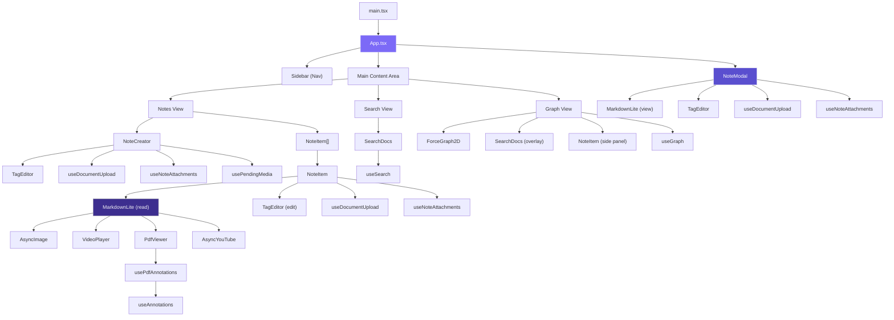

---

## Event Bus & Plugin Architecture

The app uses a custom in-process EventBus for decoupled communication. Plugins run in sandboxed environments with blocked core event emissions.

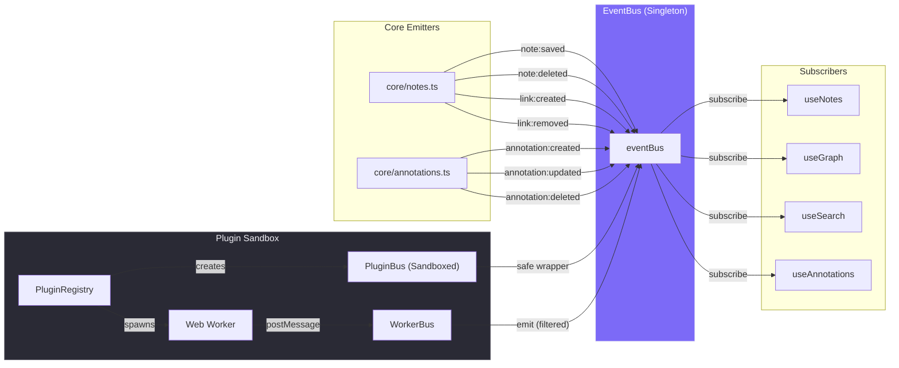

### Event Catalog

| Event | Payload | Emitted By | Consumed By |
|-------|---------|------------|-------------|
| `note:saved` | `Note` | `core/notes.ts` | useNotes, useGraph, useSearch |
| `note:deleted` | `{ id }` | `core/notes.ts` | useGraph, useSearch |
| `link:created` | `{ fromId, toId }` | `core/notes.ts` | useGraph |
| `link:removed` | `{ fromId, toId }` | `core/notes.ts` | useGraph |
| `annotation:created` | `Annotation` | `core/annotations.ts` | useAnnotations |
| `annotation:updated` | `{ id, content }` | `core/annotations.ts` | useAnnotations |
| `annotation:deleted` | `{ id }` | `core/annotations.ts` | useAnnotations |
| `plugin:registered` | `{ id }` | `PluginRegistry` | — |

> [!IMPORTANT]
> **Security guardrail**: Both `PluginBus` (inline) and the worker message handler block plugins from emitting core events (`note:saved`, `note:deleted`, `link:*`, `annotation:*`). This prevents plugins from spoofing state changes.

---

## Data Flow: Note Lifecycle

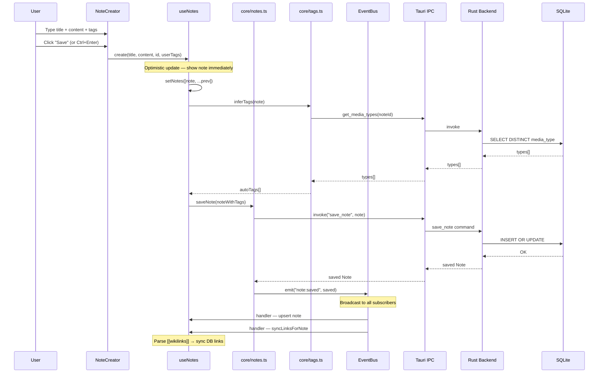

---

## Media & Asset Pipeline

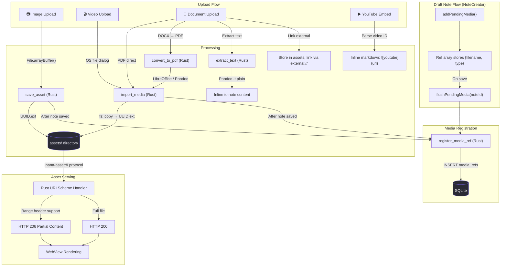

> [!TIP]
> The `jnana-asset://` custom URI protocol handler in Rust supports **HTTP 206 Partial Content** with Range headers, enabling smooth video seeking without downloading the entire file. This is critical for the Plyr-based video player.

---

## Search Architecture

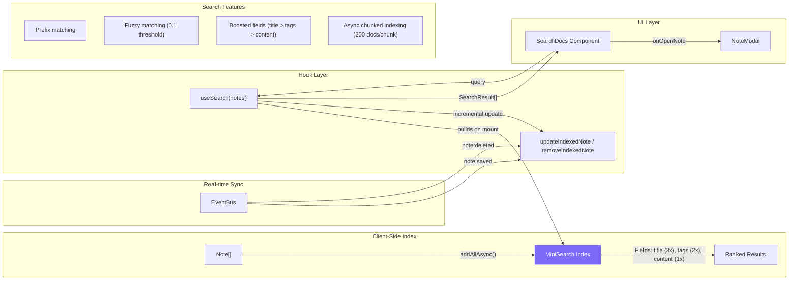

---

## Annotation System

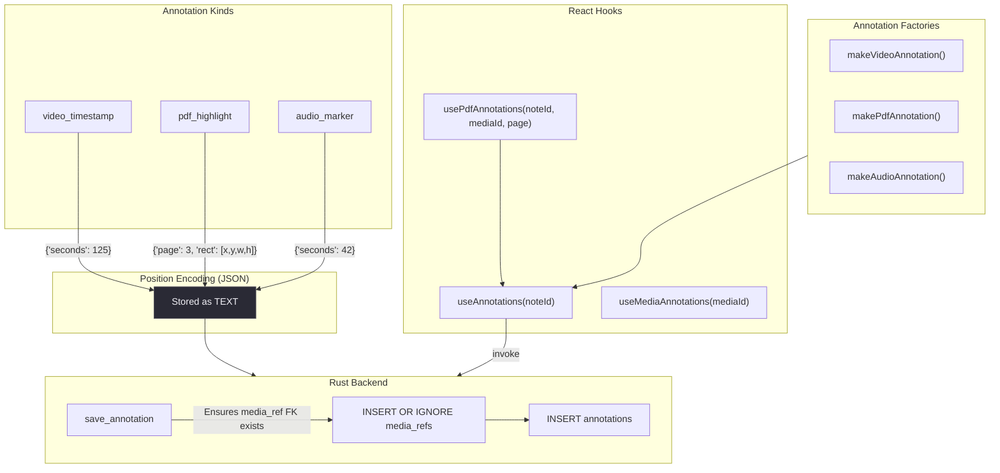

---

## Auto-Tagging Pipeline

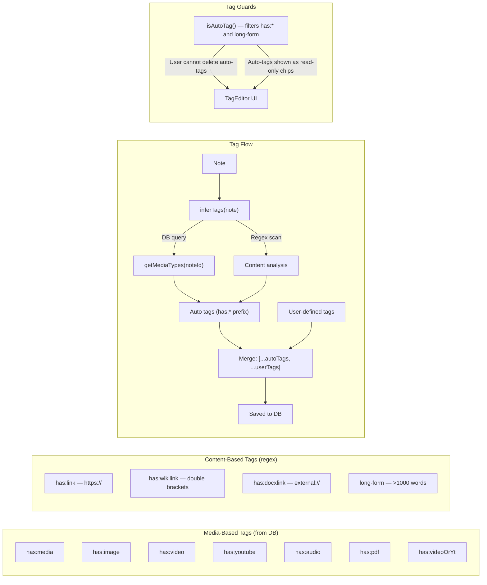

---

## Wikilink & Knowledge Graph

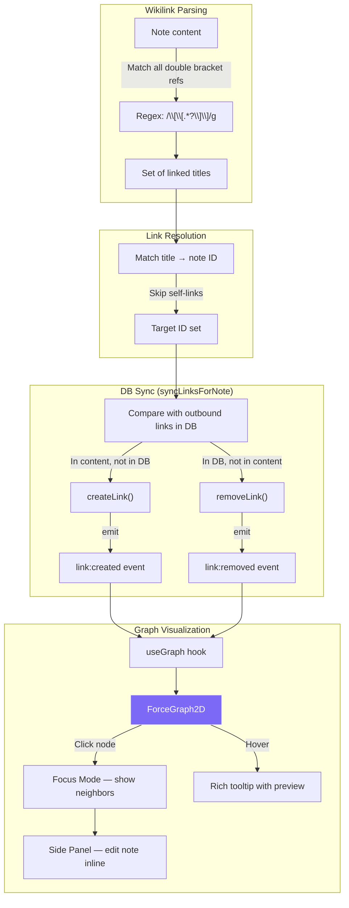

---

## MarkdownLite Rendering Pipeline

The custom `MarkdownLite` component is a rich-content renderer that parses note content and renders embedded media inline:

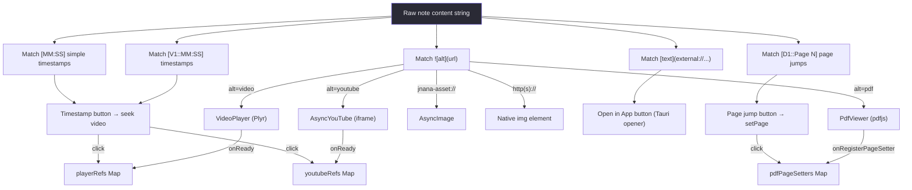

---

## File Layout

```
Jnana---A-Second-brain/
├── src/                          # React Frontend
│   ├── main.tsx                  # React DOM mount
│   ├── App.tsx                   # Root component, state owner, router
│   ├── App.css                   # Global styles + CSS custom properties
│   ├── types/
│   │   └── index.ts              # Note, Link, MediaRef, Annotation, Plugin, AppEvent
│   ├── core/                     # Tauri IPC wrappers + business logic
│   │   ├── notes.ts              # CRUD + links + assets + wikilink sync
│   │   ├── search.ts             # MiniSearch index management
│   │   ├── media.ts              # Import, convert, register media
│   │   ├── annotations.ts        # Annotation CRUD + factory helpers
│   │   └── tags.ts               # Auto-tag inference (media + content)
│   ├── hooks/                    # React state management
│   │   ├── useNotes.ts           # Global note state + optimistic updates
│   │   ├── useSearch.ts          # Search index + query state
│   │   ├── useGraph.ts           # Graph data (nodes + edges) via events
│   │   ├── useAnnotations.ts     # Per-note and per-media annotation state
│   │   ├── useDocumentUpload.ts  # Doc upload flow (PDF/DOCX/ODT)
│   │   ├── useNoteAttachments.ts # Image & video attachment handlers
│   │   ├── usePendingMedia.ts    # Deferred media_ref registration for drafts
│   │   └── usePdfAnnotations.ts  # PDF-specific highlight + page filtering
│   ├── lib/                      # Infrastructure
│   │   ├── eventBus.ts           # EventBus + PluginBus (sandboxed)
│   │   ├── pluginRegistry.ts     # Plugin lifecycle (inline + worker)
│   │   ├── pluginWorker.ts       # Worker-side bus client
│   │   └── eventBus.test.ts      # Tests for event bus security
│   ├── ui/                       # React components
│   │   ├── editor/
│   │   │   ├── NoteCreator.tsx   # New note composer
│   │   │   ├── NoteItem.tsx      # Note card (view/edit modes)
│   │   │   └── MarkdownLite.tsx  # Rich content renderer (media, timestamps, links)
│   │   ├── graph/
│   │   │   └── GraphView.tsx     # Force-directed knowledge graph
│   │   ├── media/
│   │   │   ├── VideoPlayer.tsx   # Plyr-based video (lazy, streaming)
│   │   │   └── PdfViewer.tsx     # pdfjs canvas + annotation overlay
│   │   ├── AsyncImage.tsx        # Lazy-loaded image via custom protocol
│   │   ├── AsyncVideo.tsx        # Simple lazy video element
│   │   ├── AsyncYouTube.tsx      # YouTube iframe embed (offline-aware)
│   │   ├── NoteModal.tsx         # Full-screen note viewer/editor
│   │   ├── SearchDocs.tsx        # Search UI with result cards
│   │   └── TagEditor.tsx         # Tag input (auto vs user tag chips)
│   └── themes/
│       └── default.css           # CSS custom property definitions
│
├── src-tauri/                    # Rust Backend
│   ├── src/
│   │   ├── main.rs               # Tauri builder, URI handler, command registration
│   │   ├── lib.rs                # Mobile entry point (unused)
│   │   ├── commands/
│   │   │   ├── mod.rs            # Module declarations
│   │   │   ├── notes.rs          # Note/Link CRUD commands + asset cleanup
│   │   │   ├── media.rs          # import, convert_to_pdf, extract_text, register
│   │   │   ├── annotations.rs    # Annotation CRUD with FK guard
│   │   │   └── assets.rs         # Binary blob save/get/path
│   │   └── db/
│   │       ├── mod.rs            # init_db, data_dir, assets_dir
│   │       ├── schema.rs         # Versioned migrations (currently V1)
│   │       └── queries.rs        # All SQL operations
│   ├── Cargo.toml                # Rust dependencies
│   └── tauri.conf.json           # Window, CSP, bundle config
│
├── package.json                  # Frontend dependencies
├── vite.config.ts                # Vite + React plugin
└── tsconfig.json                 # TypeScript config
```

---

## Key Design Patterns

### 1. Optimistic Updates
Every mutation (create, update, delete) applies the change to React state **before** the Rust backend confirms. The EventBus `note:saved` handler reconciles if another part of the app also triggers a save.

### 2. Single State Owner
`App.tsx` owns the `useNotes()` instance. It passes `create`, `update`, `remove` callbacks down to all views. `GraphView` never instantiates its own `useNotes()` — it uses `useGraph()` for graph-specific data and delegates mutations upward.

### 3. Deferred Media Registration
`NoteCreator` uses `usePendingMedia` to queue media_ref registrations. Since the note doesn't exist in the DB until save, media files are copied to `assets/` immediately but the FK-dependent `media_refs` row is only written after `save_note` succeeds.

### 4. Event-Driven Decoupling
The `EventBus` acts as a global pub/sub system. Core modules emit events; hooks subscribe. This keeps hooks independent — `useGraph`, `useSearch`, and `useNotes` all react to `note:saved` without knowing about each other.

### 5. Plugin Sandboxing
Plugins get a `PluginBus` that wraps the real `EventBus` with two guards:
- **Blocked emissions**: Plugins cannot emit core events (prevents state spoofing)
- **Error isolation**: Plugin handlers are wrapped in try/catch so crashes don't propagate

Worker plugins communicate via `postMessage` with the same emission filtering.
